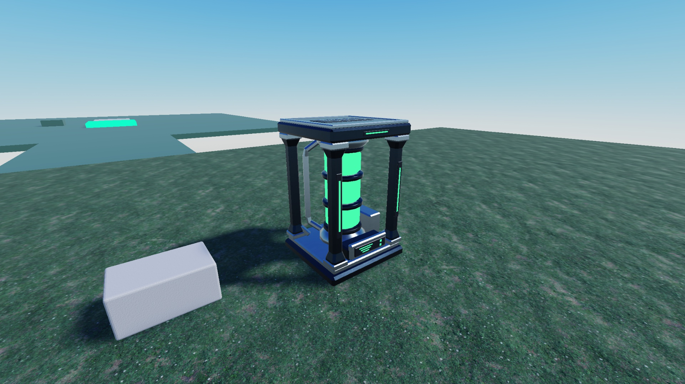
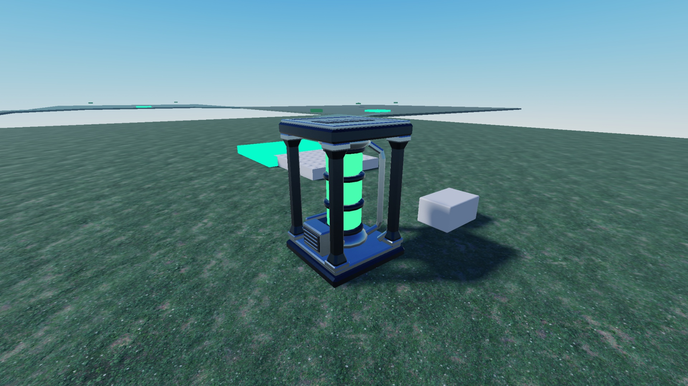

# Energy Core Generator — native Roblox appearance

Status: **Studio visual check PASS — 2026-10-02**.

The imported source is `Workspace.EnergyCoreGenerator_Source` in the connected
MonsterVault place `110304961224794`. The GLB combines the authored components
into four material meshes, named `EC_<group>_Mesh` beneath `EC_<group>` Models.
At initial inspection, the existing uncommitted appearance pass had already
applied the intended colors. This change retains those visually checked values
and makes the palette shared, deterministic and versioned.

## Palette and binding

[`MaterialPalette.luau`](../../src/shared/config/MaterialPalette.luau) is the only
Roblox appearance definition. The main Rojo project places it at
`ReplicatedStorage.MonsterVault.Shared.config.MaterialPalette`. Its table and
each style are frozen. Future assets reuse these groups and register any new
group here, with an explicit native material and color.

| Group | Roblox Material | Color3.fromRGB |
| --- | --- | --- |
| DarkMetal | Metal | 50, 63, 76 |
| SecondaryMetal | Metal | 153, 172, 187 |
| PanelPlastic | SmoothPlastic | 19, 25, 33 |
| EnergyGreen | Neon | 76, 255, 110 |

[`energy_core_appearance.luau`](../../tools/roblox/energy_core_appearance.luau)
is installed as `EnergyCoreAppearance` inside the source asset. It resolves
`EnergyCoreMaterialGroup`, or the exported part/ancestor names, or a named
imported `SurfaceAppearance`. An explicit invalid attribute is rejected.
The pass reports all unmapped meshes and validates the whole asset before
changing any appearance. Valid meshes receive native `Material` and `Color`,
an empty `MaterialVariant` and `TextureID`, and the stable group attribute.
Imported `SurfaceAppearance` children are removed after validation so PBR maps
cannot mask the native palette; the Blender and GLB sources retain their
original materials.

[`energy_core_appearance.server.luau`](../../tools/roblox/energy_core_appearance.server.luau)
is installed beside it as `ApplyEnergyCoreAppearance` (`RunContext = Server`).
It applies the same pass once during initialization. There are no per-frame
updates, component-name lists or asset-local copies of the color definitions.

After importing/reimporting the GLB, install these two scripts and the shared
palette, then run this in the **Edit** command bar before saving the asset:

```luau
local asset = workspace.EnergyCoreGenerator_Source
assert(require(asset.EnergyCoreAppearance)(asset) == 4)
```

Save the Studio asset/place with these Edit properties. Clones inherit the
native appearance immediately; runtime initialization repeats the same pass.
The full Studio place is not exported or published by this change. Fresh
imports still require this authoring pass before being considered ready.

## Source preservation

The editable source remains
[`energy_core_generator.blend`](../../assets/blender/energy_core_generator.blend)
and the export remains
[`energy_core_generator.glb`](../../assets/exported/energy_core_generator.glb).
Their SHA-256 hashes are unchanged during this appearance task and recorded
in the evidence. The existing
[`generate_energy_core.py`](../../tools/blender/generate_energy_core.py) keeps
the original reproducible Blender pipeline and resolves paths from `__file__`.
It was not rerun for this appearance-only change.

Mesh IDs, all four sizes/transforms/pivot offsets, all Model pivots, scale,
placement, existing physics settings and the `4 × 6 × 4` stud bounding box
were checked against the pre-change Studio snapshot. Nothing was moved,
rescaled, reimported or remodeled. Gameplay/world registries and IMP-10 gates
are unaffected.

## Verification

The connected Studio remained in Edit mode under its existing Lighting:
ClockTime `14.5`, Brightness `3`, Ambient/OutdoorAmbient `(70,70,70)` and
ExposureCompensation `0`. Front and rear screenshots visibly distinguish
the dark metal, lighter metal trim, dark plastic and luminous green core.
The existing palette needed no tuning or additional lights.

Studio checks passed: all four groups covered; repeat pass; clone appearance
before and after initialization; fresh-import names without attributes;
renaming with valid metadata; named material fallback; removal of texture/PBR
overrides; unknown meshes, invalid metadata and empty assets rejected. Unknown
mapping cases failed before any known mesh was changed. Geometry, mapping
source parity and the frozen palette were also checked.

Local checks passed: StyLua and Selene for the palette and both mapping scripts,
strict analysis for the shared palette, architecture dependencies, repository
integrity, and the main Rojo build. The palette uses the existing project's
native-global boundary; the baseline CLI analysis does not supply Roblox
definition files. Studio exercised the actual native Color3/Enum values.

Machine evidence and the final native instance snapshot:
[`ENERGY_CORE_APPEARANCE_2026-10-02.json`](evidence/ENERGY_CORE_APPEARANCE_2026-10-02.json).




