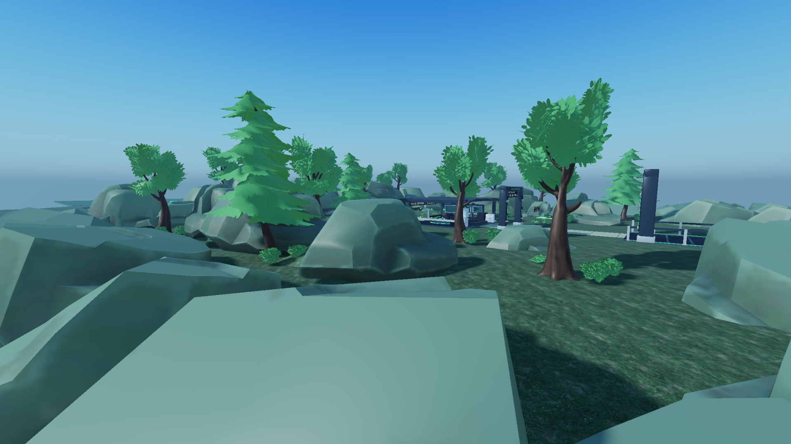
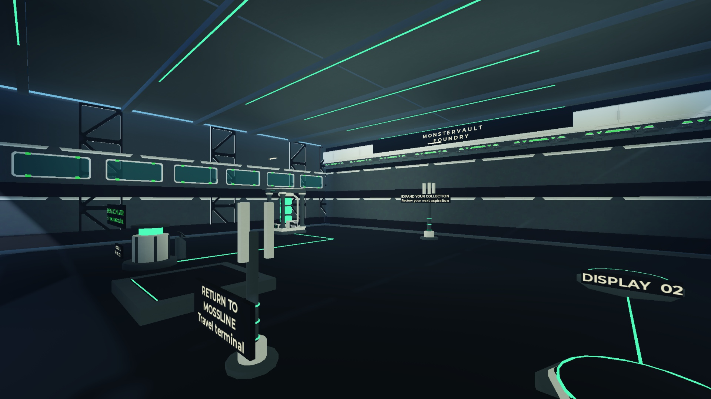

# Golden Slice comfort and reclaimed Energy direction — 2026-10-07

**Integrated space/collision/feedback pass; supplementary art import pending.**
This responds to the owner's screenshots and feedback about bare plate edges,
walk-through props, cramped spaces and the unfinished box-shaped Vault. It
continues PR #76. It does not certify final visual acceptance or any PQL gate.

## Applied in Studio and Rojo

- Starter ground: 128×128 -> 176×144 studs, about 55% more area. Home ground:
  80×80 -> 160×144, 3.6 times the area. Vault floor: 42×44 -> 76×68, about
  2.8 times the area, with a 22-stud hall height. Additional planted perimeter,
  grounded rock coastline, garden walks and two native benches use existing assets.
- Wider hall bays, roof, machinery/display placement and Energy conduits.
  Old exterior trees, rocks and grassy banks were moved outside the enlarged room;
  the rear title was separated from the bright cable header for contrast.
- Large rocks use static Hull collision. Trunks, structural posts, gate pillars
  and machine footprints use simple anchored invisible proxies. Foliage remains
  passable. Walls/floor/roof and bridge/outpost structural parts retain collision.
- Two automatic visual doors share the existing bounded render owner. They open
  on approach; Reduced Motion changes position immediately. They are nonblocking
  presentation and grant no owner/visitor access permission.
- Native button hover/press/gamepad-focus response and short modal opening.
  Reduced Motion cancels active scaling. Jump/landing/ground movement have one
  rate-zero local dust emitter, driven by avatar events and walked distance;
  Low Effects disables it. No new Heartbeat, per-prop task or sound upload.
- Capture engage/failure gets a brief cosmetic reaction on the exact observed
  creature. Existing semantic deduplication still chooses the cue; no unknown
  result becomes success. Matched successful travel gets an arrival cue.

The source-backed layout changes are exactly two ground plates and four region
bounds. Mid-A/B bounds are adjusted to avoid overlap with the wider Starter.
All other 52 native records, gameplay IDs/radii, spawn/secure/recovery/travel/
hazard coordinates and collision/tag contracts remain unchanged. The eight-stud
Vault control radius remains unchanged; controls stay by its original anchor.
Owned visual display positions now consume the same `GoldenWorldLayout` data
as the authored plinths. No server/domain/contract mutation implementation changed.

## Actual native evidence

- [World/asset native readback](native_package.json): exact recursive serialization
  parity, including MeshPart collision fidelity; 841 permanent BaseParts,
  621 MeshParts, 242,796 repeated mesh triangles, three lights, zero unmapped parts.
  This artifact currently describes the pass **before supplementary import**.
- [Source parity](source_parity.json): 111/111 native Edit sources.
- [Existing native world probe](authoring_summary.json): 29 cases pass; 315 ordinary
  ground samples and 315 hazard-free route samples. This is the existing IMP-10
  probe run against the enlarged authored world, not rewritten IMP-10 evidence.
- [Real Humanoid movement](physics_native.json): wall blocks x=46 request near
  x=37.1; large rock blocks z=-64 request near z=-48.7; tree trunk blocks passage;
  central Vault walk reaches z=155.3. Studio-only setup repositioned the avatar;
  the tested legs used ordinary Humanoid MoveTo and physics.
- [Native feedback](feedback_native.json): approach opens doors from ±5 to ±15;
  button hover scale is 1.025; Reduced Motion resets sampled scales to 1;
  native Space input produces Jumping -> Freefall -> Landed -> Running.
  Particle lifetime/rate/bounds are inspected; this is not an uninterrupted video
  or new live capture/claim proof. The new capture reaction still needs its own
  visual review during a normal capture; earlier capture/claim evidence is retained.
- [Measured frames](performance_before_import.json): 120 frames/view on this
  Studio workstation. Starter p95 17.90ms, Vault 18.02ms; opaque rendering
  150,897/44 and 38,617/43 triangles/draws. Memory is about 2,188MB and stable
  over these short samples. Reference 16.67ms/device/scale gates remain open;
  the earlier 68/101ms cadence is retained and its cause is not established.

These are unmodified native Studio JPEG captures with Halloween OFF. Camera
poses are respectively (-92,11,63) looking at (-32,3,14), and (-23,7,120)
looking at (8,7,155). They do not show the pending radioactive exterior.

Local checks: 13/13 focused Golden, 339/339 full fast, 28/28 Python, repository
integrity/dependencies, StyLua, Selene and Rojo build/sourcemap pass. Each new
commit still requires normal remote CI. Physical gamepad menus, actual increased
platform text preference, final visual acceptance and real-device performance
remain open. No later IMP-11 backend dependency was started.

## Supplementary Blender kit — READY TO IMPORT

The owner's added direction is **radioactive + wild nature**: healthy lush
vegetation reclaiming abandoned Energy infrastructure. The Vault is a controlled,
shielded reactor bunker. Rusted relics tell the history without turning every
green plant into mutated waste or changing gameplay hazards.

| Asset | Triangles | Intended placement | Current status |
| --- | ---: | --- | --- |
| ContainmentShell | 7,664 | expanded Vault, finished front/sides/rear, armor, wide portal, roof reactor | READY TO IMPORT |
| SurveyRover | 2,676 | overgrown retired survey vehicle off the main route | READY TO IMPORT |
| RelayRuins | 2,168 | two bounded reclaimed station fragments with sealed Energy relic | READY TO IMPORT |

Three individual editable `.blend` files and matching GLBs live under
`assets/{blender,exported}/environment`. Combined editable transport:
`assets/blender/radioactive_vault_import.blend`. The generator is
`tools/blender/generate_radioactive_vault.py`, using the existing Golden helpers
and the central native palette. WeatheredMetal, OxideRust and HazardAmber are
registered; warning amber remains separate from intrinsic rarity.

[Source audit](../../../../../assets/exported/radioactive_source_audit.json)
validates 3/3 Blender/GLB assets and all 12,508 triangles: material metadata,
applied transforms, nondegenerate topology and matching exported mesh counts.
Blender MCP is unavailable in this session; the approved Blender 5.2 CLI fallback
was used. **These assets are not native-validated or complete yet.**

## Resume the pending import

1. In Studio Edit, File -> Import:
   `assets/exported/radioactive_vault_import.fbx`, with Upload to Roblox enabled.
   Leave the raw import intact. Do not re-upload the eleven existing audio files.
2. Load `radioactive_vault_geometry.json` and run `finish_golden_import.luau`
   against the imported root with `extend=true`. Verify every persistent MeshId,
   dimension, orientation and palette group. Preserve a dedicated native manifest.
3. Run `finish_golden_comfort.luau` again. It conditionally installs the shell,
   two ruin clusters and rover only when their prefabs are present, with separate
   simple static proxies; a combined shell Hull must never seal the interior.
4. Inspect front/side/rear/roof, entry, normal camera scale, collisions, route
   clearance and Halloween OFF/ON. Iterate the source as needed. Re-export both
   native packages and update the evidence only after that actual inspection.

Full composition reproduction: `build_golden_world.luau`, then
`refresh_golden_world.luau`, then `finish_golden_comfort.luau`. The last pass is
Edit-only and replaces its own layer/doors instead of accumulating duplicates.
Normal Rojo delivery already contains the current expanded native world.
For an export audit, retain the original sorted `RefreshAnchorSnapshot`; pass
the six `GoldenWorldLayout.world` overrides to `export_refresh_package.luau`.
Any difference beyond those six geometry changes fails the export assertion.
