# Native Golden Slice gallery

All images below came from actual Roblox Studio/client state. PNG conversion changed only the file format. [Capture metadata and hashes](screenshots.json), [implementation and limitations](../../GOLDEN_SLICE_EVIDENCE.md), [acceptance matrix](../../GOLDEN_SLICE_ACCEPTANCE_MATRIX.md).

| View | Native evidence |
| --- | --- |
| Permanent Starter | 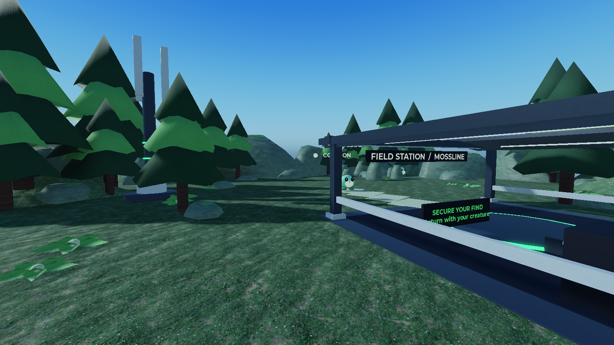 |
| Matched Halloween Starter | 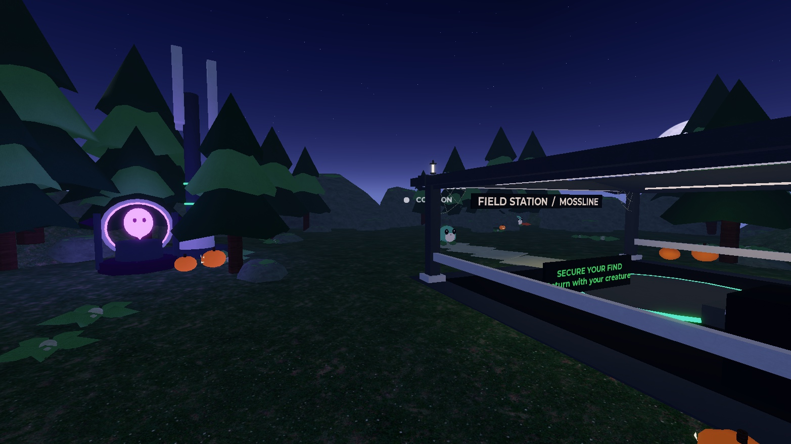 |
| Field Station / secure point | 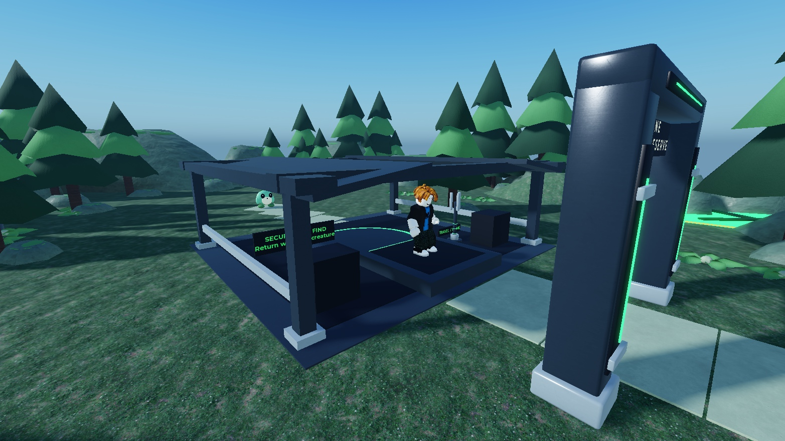 |
| Common Mossbud | 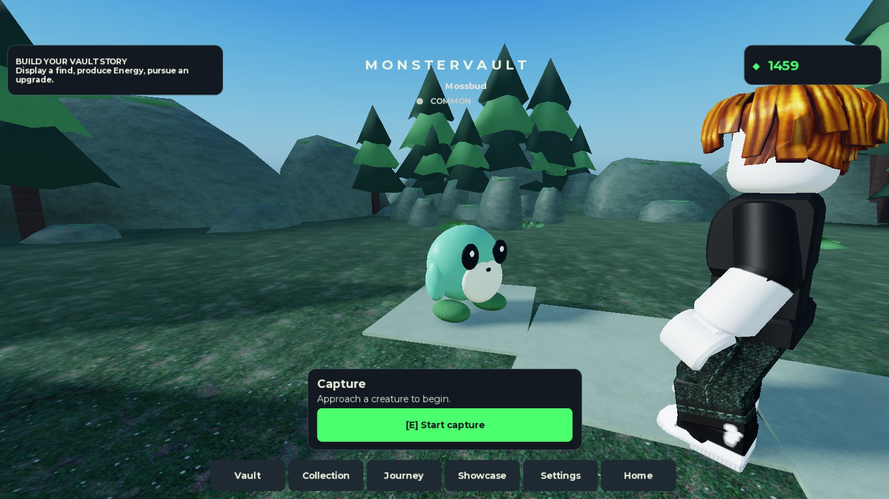 |
| Capture engage | 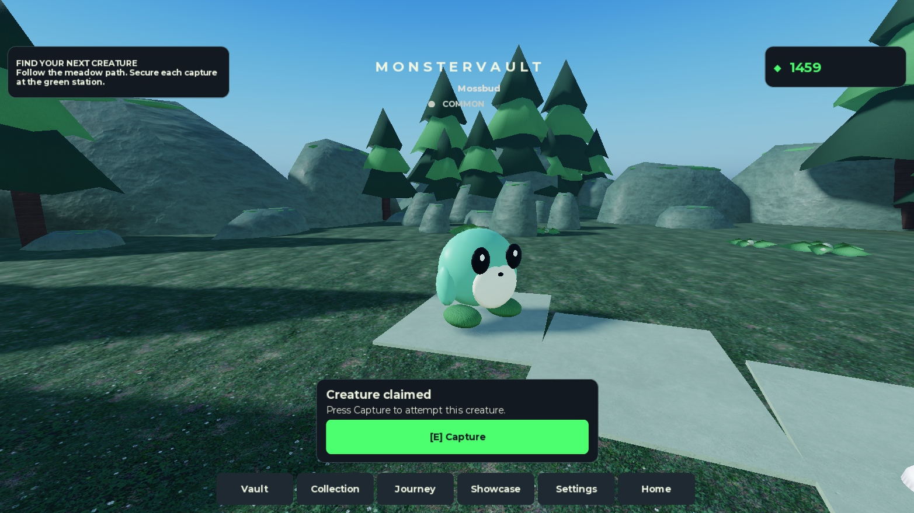 |
| Actual Secured result | 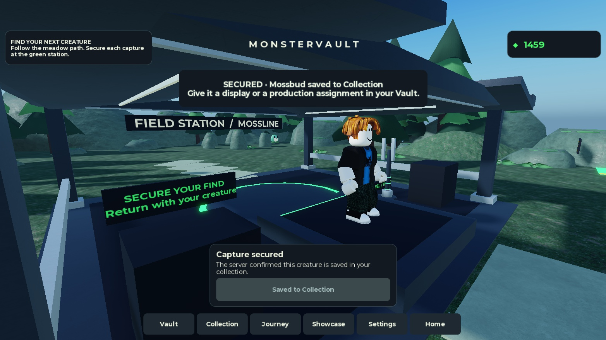 |
| Protected Helion Legendary DEV | 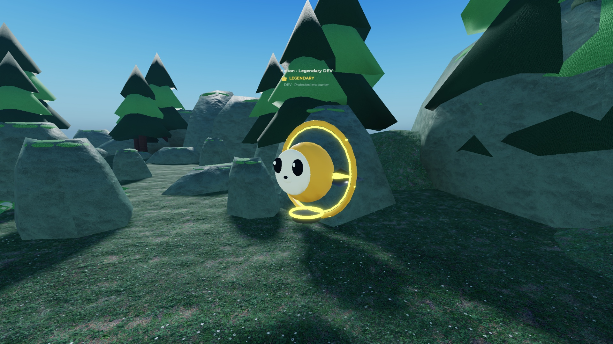 |
| Permanent Home entry | 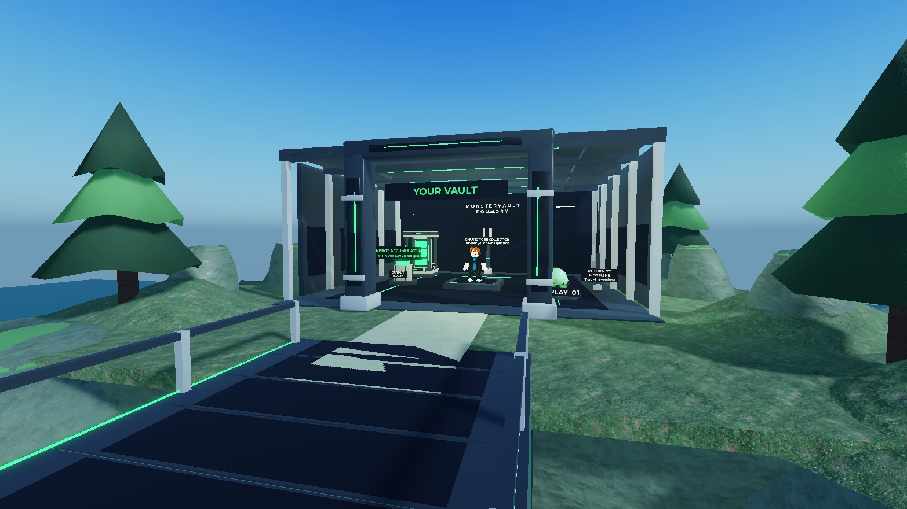 |
| Vault interior | 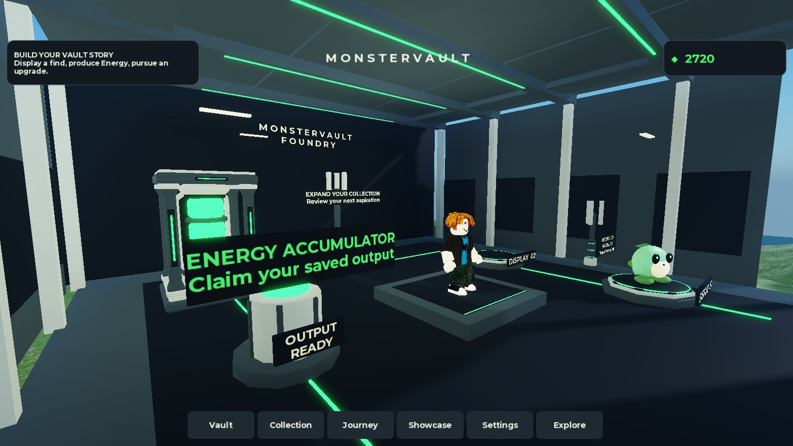 |
| Exact owned display | 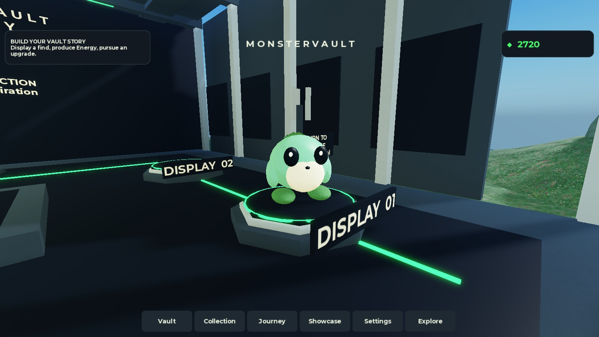 |
| Matched +8 Energy claim/count-up | 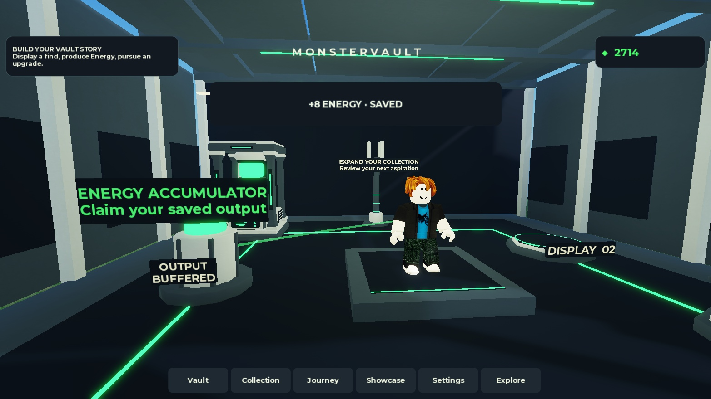 |
| Next capacity aspiration | 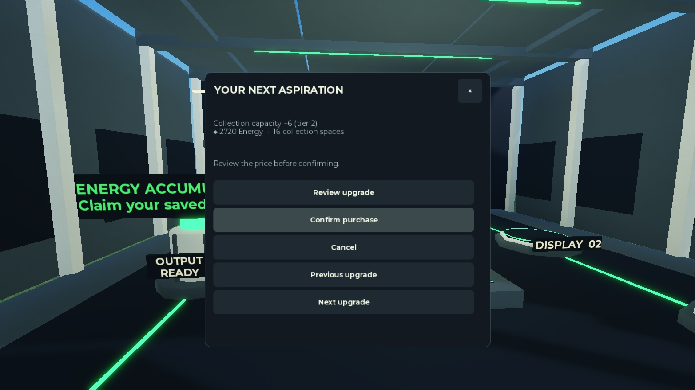 |
| Read Only card, current owner preview | 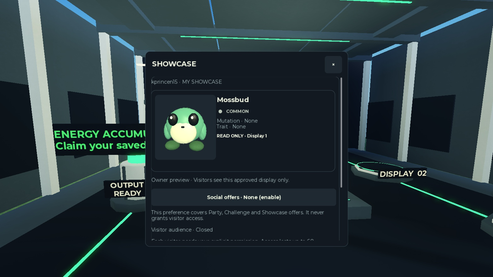 |
| A06 emulator Showcase, landscape | 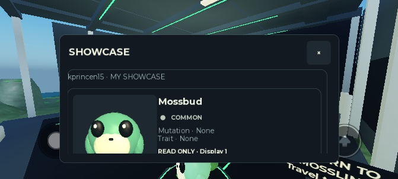 |
| Reduced Motion / LOW / audio OFF | 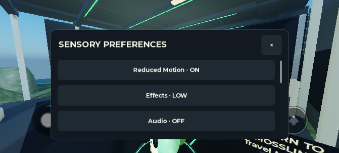 |

The Legendary is the existing isolated protected DEV probe, not evidence of live odds. Showcase screenshot 13 is an owner preview; [29 distinct native visitor/authority checks](showcase_native.json) use one actual client and three peer adapters. Capture and Energy frames pair with authoritative native JSON histories; no uninterrupted video was captured.

Additional native views: [Home Halloween matched pair](golden_home_halloween_pair.png), [capture failure](golden_capture_failure.png), [physical controller custody](golden_capture_custody_gamepad.png), [Collection phone](golden_collection_phone_final.png), [1.5x font stress HUD](golden_text_stress_hud.png), [1.5x portrait Collection](golden_text_stress_portrait.png), [reduced claim final wallet](golden_reduced_claim_semantics.png).

Only [Starter before capture](01-before-spawn.jpg) and [initial native inventory](studio_before.json) were retained as BEFORE evidence. Missing before views are not recreated. Other regions/screens remain outside the Golden scope.
